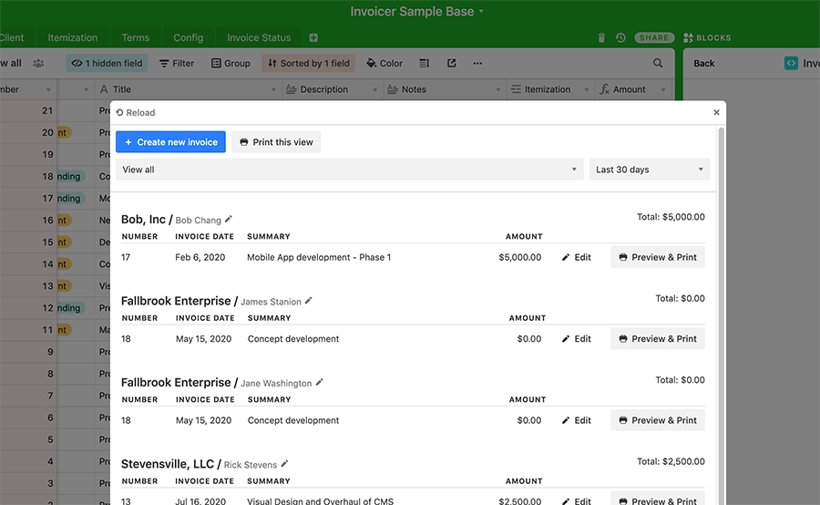

# Invoicer for Airtable Blocks

This an easy-to-use Airtable Block that allows for quick invoice generation. Invoices are generated using standard browser save to PDF, allowing users to send invoices using their preferred method (email, snail mail, etc.).

## How to run this block

1. Copy this reference [Invoicer Airtable Base](https://airtable.com/invite/l?inviteId=invZDw9bcwSGswERd&inviteToken=762aa47a7e5e6f862c2d31aa4a802c64b87a67492f3b82accf4b52fe049e8ca6).
2. Create a new block in your new base, selecting _Remix from GitHub_ template, using the GitHub repository URL: `https://github.com/MixableStudio/invoicer`

## See the block running

